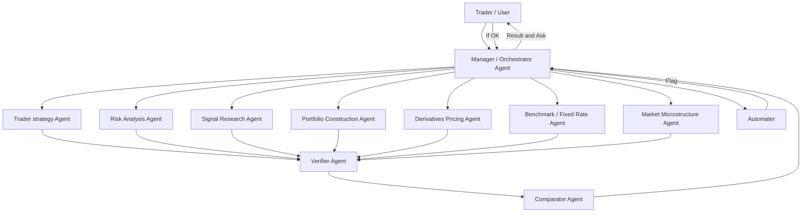

# IRIS: Intelligent Reasoning & Inferential Simulator-hackanova-26
> An agentic AI backtesting platform that lets traders describe strategies in plain English and instantly receive a full performance tearsheet — equity curve, Sharpe ratio, max drawdown, and win rate.

---

## Overview

IRIS solves a core problem in quantitative trading: most backtesting tools demand either coding expertise or expensive platform subscriptions. IRIS removes both barriers.

A trader types a strategy in natural language — *"Buy when the 50-day MA crosses above the 200-day MA, sell when RSI exceeds 70"* — and IRIS automatically:

1. Parses the intent using an LLM
2. Runs a realistic historical simulation with friction modelling
3. Benchmarks the strategy against an expert algorithm
4. Returns a clean performance tearsheet
5. Optionally automates the winning strategy for live deployment

---
## System Architecture


---

## Agent Descriptions

### 1. Manager / Orchestrator Agent

The central brain of IRIS. Responsible for:

- **NLP parsing** of the trader's plain-English strategy prompt
- **Task allocation** — dispatches jobs to the Trader Strategy Agent and selects the appropriate Expert Agent
- **Result synthesis** — translates the Comparator's tearsheet back into plain English for the trader
- **Loop control** — accepts iteration requests ("what if I change the stop-loss to 5%?")
- **Automator trigger** — calls the Automator Agent if the trader approves a strategy for live deployment

### 2. Trader Strategy Agent

Executes the trader's strategy exactly as interpreted by the Manager. Responsibilities:

- Translates structured trading rules into executable simulation logic
- Runs historical backtest with realistic friction (commissions, slippage, bid-ask spread)
- Passes simulation results to the Verifier Agent

### 3. Expert Agents

A suite of domain-specialist agents. The Manager selects the relevant Expert Agent based on the trader's strategy type. Each acts as an independent benchmark.

| Agent | Domain | Algorithms Used |
|---|---|---|
| **Risk Analysis Agent** | Risk modelling and stress testing | Monte Carlo Simulation, GARCH |
| **Derivatives & Pricing Agent** | Options and structured product pricing | Black-Scholes-Merton, Binomial Tree |
| **Portfolio Construction Agent** | Asset allocation and weight optimisation | Mean-Variance Optimisation, Black-Litterman |
| **Alpha Generation & Signal Agent** | Excess return generation, signal research | Kalman Filter, Statistical Arbitrage / Pairs Trading |
| **Fixed Income & Rates Agent** | Bond pricing and rate risk | Duration & Convexity Analysis, Short Rate Models (Vasicek / CIR) |
| **Market Microstructure Agent** | Execution quality and order flow | Hidden Markov Models (HMM), VWAP/TWAP |

### 4. Verifier Agent

Quality gate between simulation and comparison. Responsibilities:

- Receives outputs from both the Trader Strategy Agent and the Expert Agent
- Cross-checks both outputs against the original requirements set by the Manager
- If either output is incorrect or incomplete, returns the task to the responsible agent for revision
- Only passes verified results downstream to the Comparator

### 5. Comparator Agent

Side-by-side performance evaluation. Responsibilities:

- Compares the Trader Strategy simulation against the Expert Agent benchmark
- Produces the unified **performance tearsheet**:
  - Equity curve
  - Sharpe ratio
  - Maximum drawdown
  - Win rate
- Returns tearsheet to the Manager for presentation to the trader

### 6. Automator Agent

Live deployment handler. Responsibilities:

- Receives deployment instructions from the Manager once the trader approves a strategy
- Implements the selected strategy (trader's or expert's) into the live trading pipeline
- Reports success or error back to the Manager, which relays the status to the trader in plain English

---

## User Flow

```
1. Trader types strategy in plain English
2. Manager parses intent and allocates agents
3. Trader Strategy Agent runs the trader's simulation
4. Expert Agent runs its benchmark simulation in parallel
5. Verifier Agent validates both outputs
6. Comparator Agent produces tearsheet
7. Manager presents results and asks:
        "Would you like to automate your strategy or the expert's?"
8. If confirmed → Automator Agent deploys the strategy
```

---

## Expected Output (Tearsheet)

| Metric | Description |
|---|---|
| **Equity Curve** | Portfolio value over time — visualised as a line chart |
| **Sharpe Ratio** | Risk-adjusted return (annualised excess return / volatility) |
| **Max Drawdown** | Largest peak-to-trough decline in portfolio value |
| **Win Rate** | Percentage of trades that closed in profit |

---

## Technology Stack

| Layer | Technology |
|---|---|
| LLM / NLP | Claude (Anthropic) — strategy parsing, NLP, result narration |
| Agent Orchestration | LangGraph / custom multi-agent loop |
| Backtesting Engine | Custom Python engine with friction modelling |
| Data | Historical OHLCV via Yahoo Finance / Alpaca / custom feed |
| Algorithms | NumPy, SciPy, pandas, arch (GARCH), py_vollib (options) |
| API Layer | FastAPI |
| Frontend | React + Recharts (tearsheet visualisation) |
| Deployment | Docker |

---

## Project Structure

See [`STRUCTURE.md`](./STRUCTURE.md) for the full annotated file tree.

---

## Getting Started

### Prerequisites

- Python 3.11+
- Node.js 18+ (frontend)
- Docker (optional, for containerised run)

### Installation

```bash
# Clone the repository
git clone https://github.com/your-org/iris.git
cd iris

# Backend setup
python -m venv venv
source venv/bin/activate
pip install -r requirements.txt

# Frontend setup
cd frontend
npm install
cd ..

# Configure environment
cp .env.example .env
# Add your ANTHROPIC_API_KEY and data provider credentials
```

### Running Locally

```bash
# Start the backend API
uvicorn app.main:app --reload

# In a separate terminal — start the frontend
cd frontend && npm run dev
```

Navigate to `http://localhost:5173` and type your strategy.

---

## Example Strategies

```
"Buy when the 50-day MA crosses above the 200-day MA.
 Sell when RSI exceeds 70 or the position drops 5% from entry."

"Enter a long position in AAPL when implied volatility drops below 20.
 Exit after 30 days or when IV spikes above 35."

"Pairs trade: go long MSFT, short GOOGL when the spread
 exceeds 2 standard deviations from its 60-day mean."
```

---

## Roadmap

- [ ] Multi-asset portfolio backtesting
- [ ] Live paper trading integration
- [ ] Strategy versioning and comparison history
- [ ] Conversational iteration ("what if I tighten the stop-loss?")
- [ ] Sentiment signal ingestion (news, earnings)
- [ ] PDF tearsheet export

---

## License

MIT License. See `LICENSE` for details.
