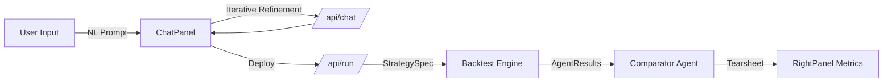

# IRIS — Quant Workstation: UI/UX Blueprint

This document provides a comprehensive technical blueprint for the IRIS workstation, designed for institutional-grade quantitative research and strategy development.

## 1. Visual Identity & Design Tokens

IRIS uses a "High-Density Cyber-Bloomberg" aesthetic, prioritizing information density, clarity, and sleek dark modes.

- **Backgrounds**: Deep Obsidian (`#07090F`), Surface (`#0C1018`), Panel (`#101520`).
- **Accents**: 
  - **IRIS Teal**: `#00E5C3` (Primary, Actions, Branding).
  - **Success Green**: `#1ED98A` (Positive PnL, Online Status).
  - **Warning Red**: `#FF4466` (Drawdowns, Risk).
  - **Cyber Blue**: `#4F9EFF` (Benchmark, Comparison).
- **Typography**:
  - **JetBrains Mono**: For data, metrics, and terminal elements.
  - **DM Sans**: For headings and readable text.
- **Glassmorphism**: Subtle 1px borders with `rgba(255,255,255,0.05)` and glow effects on active status indicators.

---

## 2. Layout Architecture

The UI follows a rigid but flexible "Bloomberg Dock" approach.

### A. Persistent Sidebar (`Sidebar.tsx`)
- **Width**: `52px`.
- **Position**: Left-pinned.
- **Function**: Master navigation toggling "Drawers".
- **Icons**: 
  - `MessageSquare`: Cognitive Chat Drawer.
  - `Terminal`: Strategy Input Drawer.
  - `Settings2`: Parameters Drawer.
  - `Layers`: Algorithm Selection Drawer.
  - `Activity`: Pipeline Status Drawer.
  - `Cpu`: IRIS Expert Intelligence (Right).

### B. Workspace Canvas (`page.tsx`)
The main workspace is a 3-column flex container:
1. **Left Drawer (`300px`)**: Collapsible context panel driven by Sidebar state.
2. **Center Canvas (Flexible)**: High-performance charting and simulation zone.
3. **Right Profile (`300px`)**: Metrics, Trade logs, and Deployment controls.

---

## 3. Core Functionalities

### 💬 Conversational Strategy Engine (`ChatPanel.tsx`)
- **Interactive Chat**: Users describe strategies in plain English (Natural Language).
- **IRIS Node Connection**: Connects to `/api/chat` for iterative strategy refinement.
- **Finalization Trigger**: "Execute Finalized Strategy" button that hydrates the full engine payload.

### 🧪 Strategy Lab (`LeftPanel.tsx`)
- **NL Prompt**: Direct text area for strategy specification.
- **Parameters**: Range sliders for Initial Capital, Commission (bps), Slippage (bps), and MC Paths.
- **Algorithm Switcher**: Select between Risk Analysis, Alpha Signal, Portfolio Construction, etc.

### 📈 Cognitive Visualization (`CenterPanel.tsx`)
- **Multi-Series Charts**: Equity curve vs. Benchmark (SPY) vs. Expert Strategy.
- **Simulation Overlay**: Visualizes 100+ Monte Carlo paths simultaneously using lower opacity glow lines.
- **Grid Context**: High-density sub-headers showing peak equity, volatility, and runtime.

### 📊 Performance Tearsheet (`RightPanel.tsx`)
- **Telemetry Tabs**: Metrics (CAGR, Sharpe, etc.), Trade Log, and IRIS Cognitive Summary.
- **Conviction Gauges**: Visual sliders showing IRIS's conviction in the strategy.
- **Automation Pipeline**: "Automate Expert Strategy" handles direct deployment.

---

## 4. Technical Stack & Routes

### Frontend (Next.js 14)
- **State Management**: React `useState` + `useCallback` for strategy orchestration.
- **API Client**: Axios-based `apiClient.ts` with typed requests.
- **Icons**: `lucide-react`.

### Backend (FastAPI) & Connections
- **POST `/api/run`**: Full backtest and expert analysis pipeline.
- **POST `/api/chat`**: Conversational refinement endpoint.
- **POST `/api/automate`**: Strategy deployment.
- **WS `/ws`**: Real-time ticker and status updates.

---

## 5. Data Schema Flow

## 6. Setup & Execution

1. **Backend**: `uvicorn app.main:app --reload`
2. **Frontend**: `npm run dev`
3. **Workspace**: Open `localhost:3000`, toggle the Chat icon, and describe your edge.
